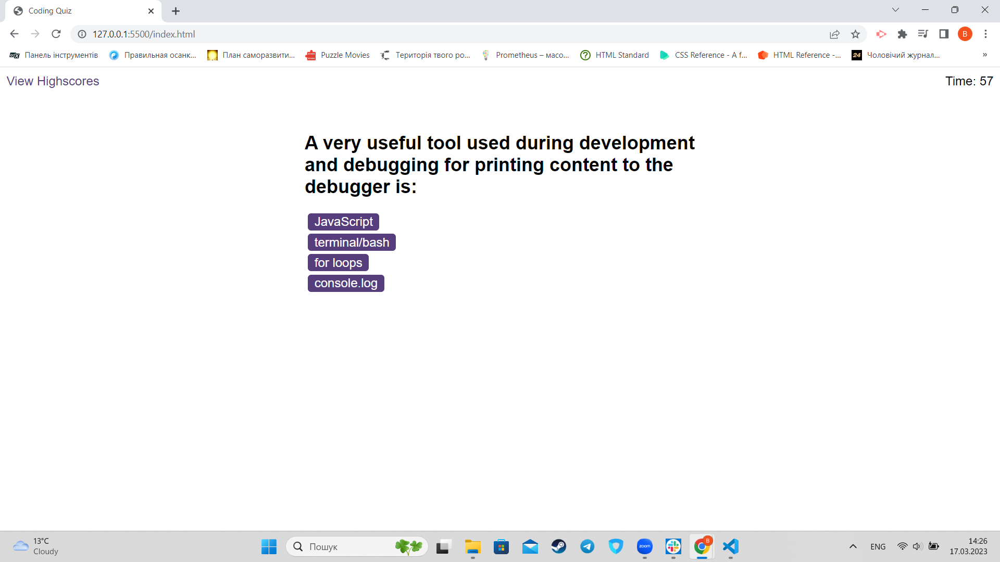
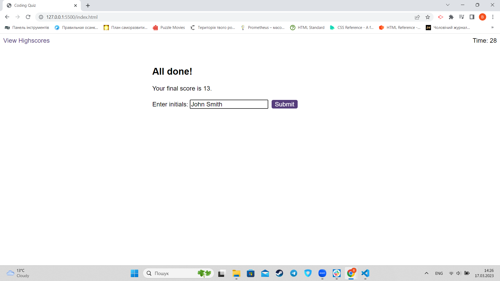
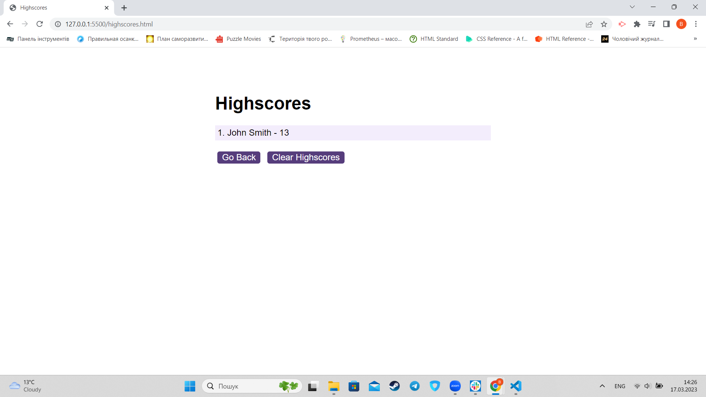

# Quiz-Game

## Description
This is a simple quiz application that allows a user to play a game answering questions and gaining scores.
The app does:

Display questions;

Display time lef;

If the answer clicked was incorrect then subtract time from the clock;

The quiz ends when all questions are answered or the timer reaches 0.

When the game ends, the app will display score and give the user the ability to save their initials and their score.

## Installation

N/A

## Usage

In order to see the app follow the link. To start a game click "Start Quiz". Click "View Highscores" in order to see previous results.

https://hllmtrxwrld.github.io/Quiz-Game/

## Credits

N/A

## License

N/A